# EPOS — Sistema de Gestión Comercial
## Documentación de Funcionalidades

> Sistema integral de Punto de Venta y Gestión Comercial para el mercado argentino, con soporte multitenant, facturación electrónica AFIP y ecommerce integrado.

---

## Tabla de Contenidos

1. [Visión General](#visión-general)
2. [Arquitectura del Sistema](#arquitectura-del-sistema)
3. [Módulos Principales](#módulos-principales)
4. [Flujos de Negocio](#flujos-de-negocio)
5. [Integraciones Externas](#integraciones-externas)
6. [Roles y Permisos](#roles-y-permisos)
7. [Modelo de Datos](#modelo-de-datos)
8. [Multitenant](#multitenant)
9. [Stack Tecnológico](#stack-tecnológico)

---

## Visión General

EPOS es una plataforma SaaS diseñada para empresas argentinas que requieren:

- Gestión completa del ciclo de ventas
- Facturación electrónica con autorización AFIP
- Control de inventario en tiempo real
- Ecommerce con pagos online (MercadoPago)
- Soporte multi-empresa con bases de datos aisladas
- Asistentes de IA para automatización de procesos

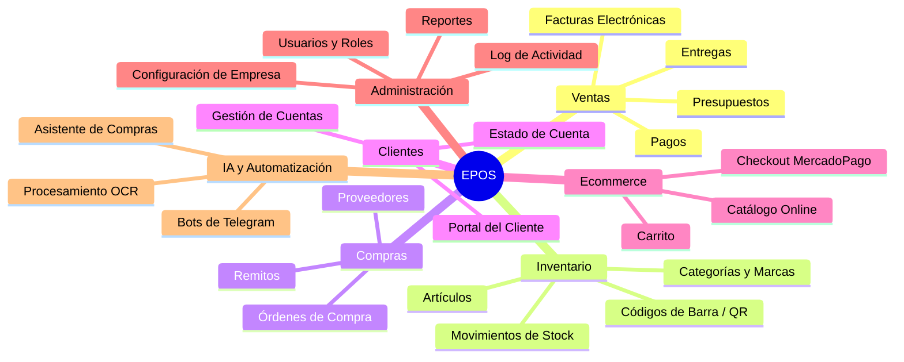

---

## Arquitectura del Sistema

### Arquitectura General

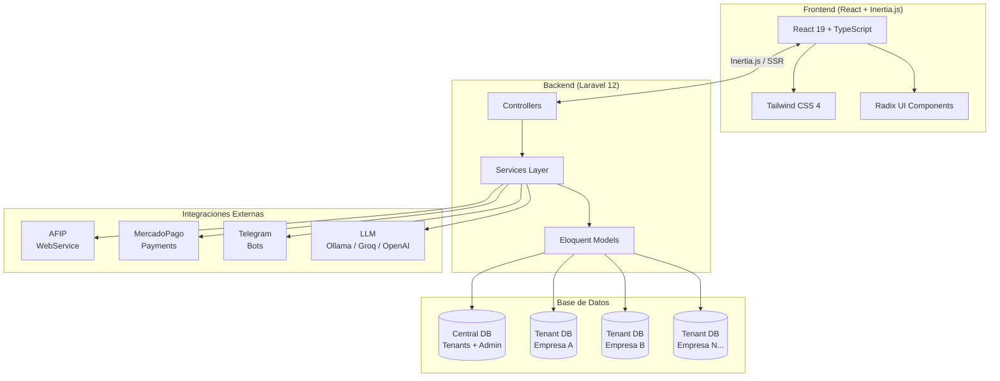

### Flujo de Peticiones

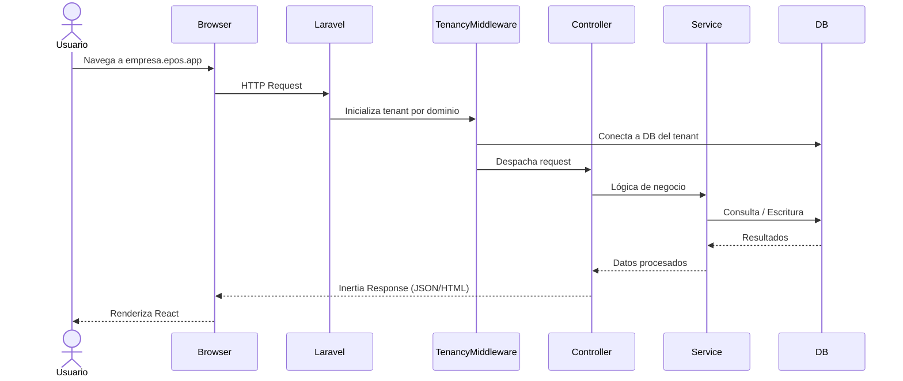

---

## Módulos Principales

### 1. Módulo de Ventas

Gestión completa del ciclo de ventas desde el presupuesto hasta la entrega.

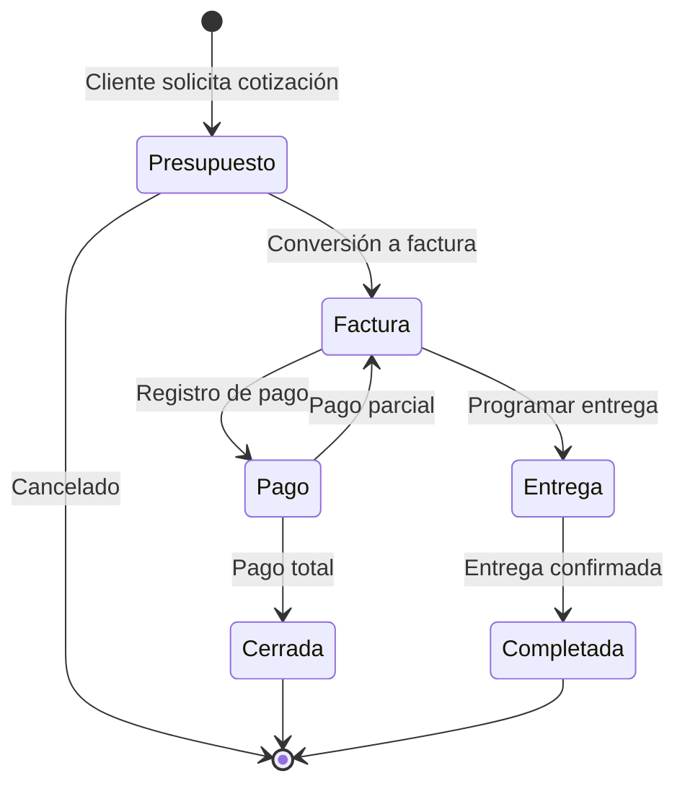

**Funcionalidades:**

| Funcionalidad | Descripción |
|---|---|
| Presupuestos | Crear y enviar cotizaciones a clientes |
| Facturas Electrónicas | Generación de Facturas A/B con autorización CAE AFIP |
| Tipos de Comprobante | Factura A, B, Nota de Débito, Nota de Crédito |
| Pagos Parciales | Registrar abonos sucesivos hasta cancelar la deuda |
| Entregas | Programar y confirmar entregas de mercadería |
| PDF Automático | Generación de comprobantes en PDF con formato AFIP |
| Conversión | Flujo Presupuesto → Factura → Entrega en un clic |

---

### 2. Módulo de Clientes

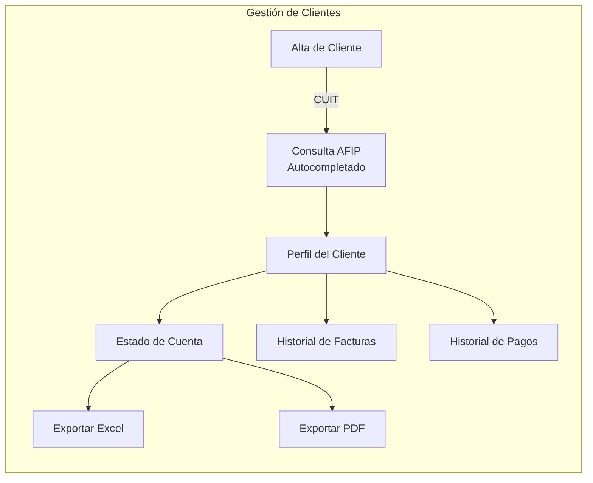

**Funcionalidades:**

| Funcionalidad | Descripción |
|---|---|
| CRUD Completo | Alta, baja, modificación y listado de clientes |
| Consulta AFIP por CUIT | Auto-relleno de datos fiscales desde AFIP |
| Condición IVA | Responsable Inscripto, Consumidor Final, Monotributista, etc. |
| Estado de Cuenta | Saldo, deudas y movimientos por período |
| Exportación | Exportar estado de cuenta a Excel y PDF |
| Portal del Cliente | Acceso limitado para que el cliente vea su cuenta |

---

### 3. Módulo de Artículos e Inventario

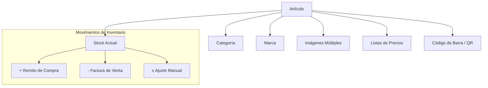

**Funcionalidades:**

| Funcionalidad | Descripción |
|---|---|
| Catálogo de Artículos | Creación y gestión con descripción, código, precio base |
| Imágenes Múltiples | Soporte para varias fotos por producto con imagen principal |
| Categorías y Marcas | Organización jerárquica del catálogo |
| Control de Stock | Stock actual, mínimo, y alertas de reposición |
| Códigos de Barra | Generación e impresión de etiquetas con barcode/QR |
| Scanner Integrado | Interfaz de escaneo para alta velocidad en ventas |
| Movimientos | Trazabilidad completa de entradas y salidas |

---

### 4. Módulo de Listas de Precios

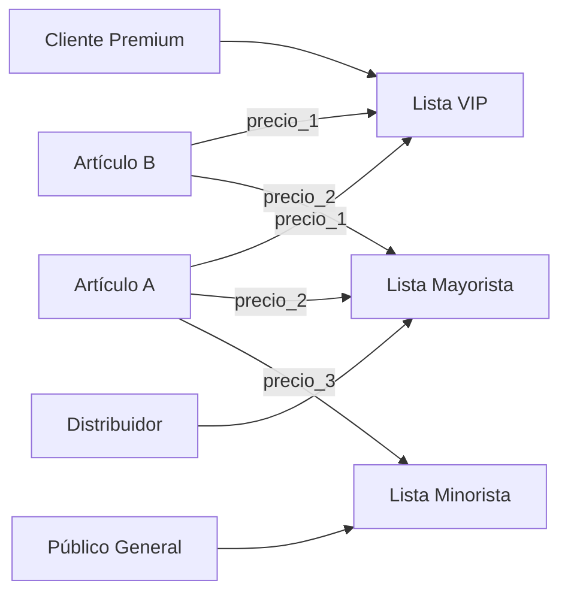

**Funcionalidades:**

| Funcionalidad | Descripción |
|---|---|
| Múltiples Listas | Crear N listas de precios diferenciadas |
| Precio por Artículo | Precio independiente por artículo en cada lista |
| Actualización Masiva | Subir / bajar precios por porcentaje en toda la lista |
| Asignación a Clientes | Vincular una lista de precios a cada cliente |

---

### 5. Módulo de Compras y Proveedores

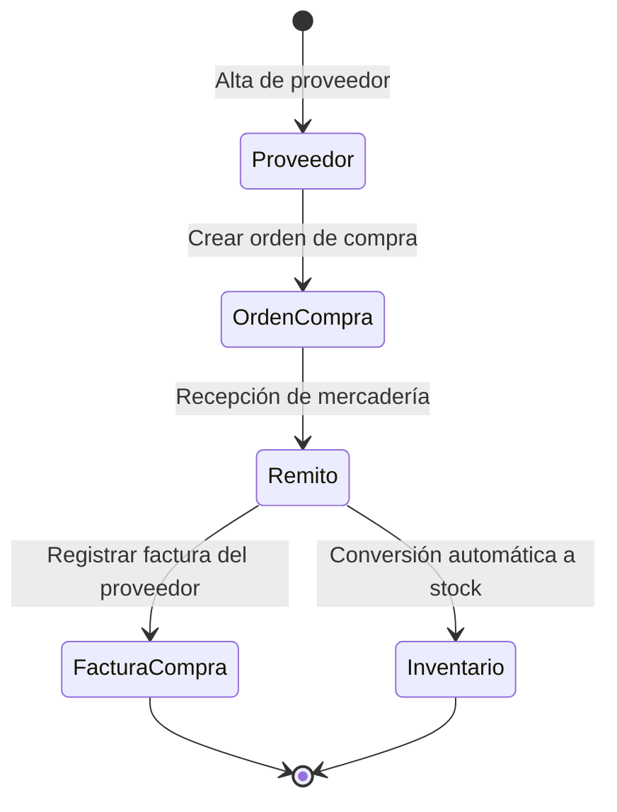

**Funcionalidades:**

| Funcionalidad | Descripción |
|---|---|
| Gestión de Proveedores | Alta y mantenimiento de proveedores |
| Órdenes de Compra | Crear y seguir órdenes de compra |
| Remitos | Registrar recepciones de mercadería |
| Stock Automático | El remito actualiza el inventario automáticamente |
| Asistente IA | Extrae datos de facturas PDF del proveedor con OCR |

---

### 6. Módulo de Ecommerce

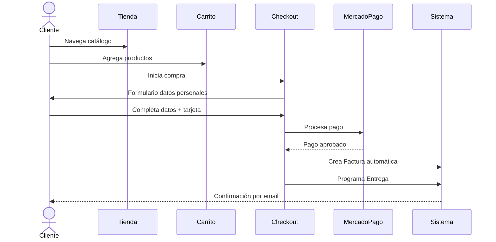

**Funcionalidades:**

| Funcionalidad | Descripción |
|---|---|
| Tienda Online | Catálogo público de productos con imágenes y precios |
| Carrito de Compras | Carrito persistente por sesión/usuario |
| Checkout Multi-paso | Datos personales → Pago → Confirmación |
| MercadoPago | Tarjetas de crédito/débito con cuotas |
| Auto-registro | Crea al cliente en el sistema si es nuevo |
| Factura Automática | Genera la factura internamente al aprobar el pago |

---

### 7. Módulo de Administración

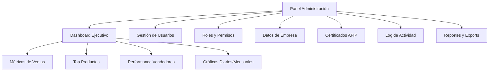

**Funcionalidades:**

| Funcionalidad | Descripción |
|---|---|
| Dashboard | KPIs de ventas, productos más vendidos, comparativas |
| Usuarios | Alta, baja y modificación de usuarios del sistema |
| Roles | Asignar permisos por rol (Superadmin/Admin/Vendedor/Cliente) |
| Datos de Empresa | Razón social, CUIT, domicilio, condición fiscal |
| Certificados AFIP | Subir y validar certificados digitales `.pfx` |
| Audit Log | Registro completo de todas las acciones del sistema |
| Exportaciones | Excel con datos de ventas, inventario y cuentas |

---

## Flujos de Negocio

### Ciclo de Venta Completo

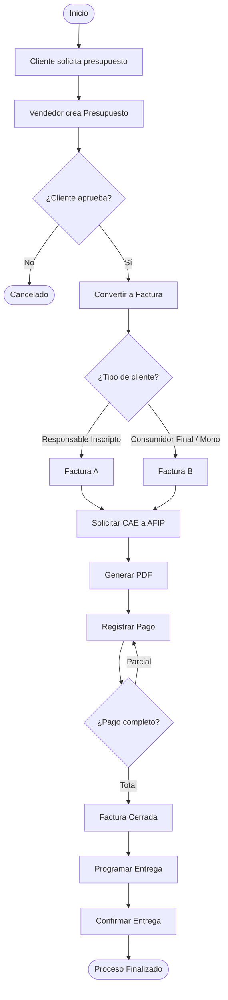

### Flujo de Compra Online

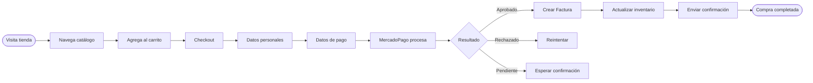

### Recepción de Mercadería

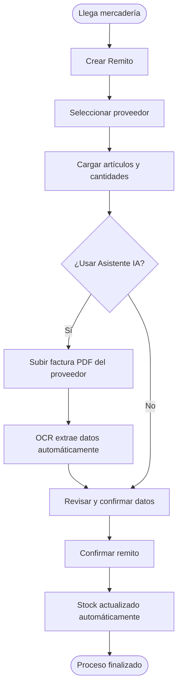

---

## Integraciones Externas

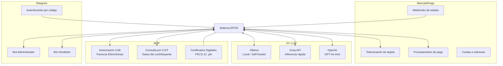

### AFIP

| Funcionalidad | Descripción |
|---|---|
| Autorización CAE | Obtiene el Código de Autorización Electrónica para cada factura |
| Tipos de Factura | Determina automáticamente si emitir Factura A o B |
| Consulta CUIT | Obtiene razón social, domicilio y condición fiscal desde AFIP |
| Certificados | Gestión de certificados digitales `.pfx` para firma electrónica |
| Desglose IVA | Calcula y desglosa correctamente las alícuotas de IVA |
| Modos | Soporte para ambiente de homologación (testing) y producción |

### MercadoPago

| Funcionalidad | Descripción |
|---|---|
| Tokenización | El SDK de MercadoPago tokeniza los datos de tarjeta en el browser |
| Pago Seguro | Los datos de tarjeta nunca pasan por los servidores propios |
| Cuotas | Soporte para pagos en cuotas según el banco emisor |
| Webhooks | Actualización automática del estado del pago |
| Referencias | Cada pago MP está vinculado a la factura interna |

### Telegram Bots + IA

| Funcionalidad | Descripción |
|---|---|
| Bot Admin | Alertas de stock, resúmenes de ventas, aprobaciones pendientes |
| Bot Vendedor | Consultas de clientes, registro rápido de pedidos |
| Autenticación | Vinculación de cuenta con código de verificación |
| Function Calling | Los bots pueden ejecutar acciones reales en el sistema |
| Historial | Conversaciones guardadas con contexto persistente |
| Proveedores LLM | Configurable: Ollama (local), Groq, OpenAI |

---

## Roles y Permisos

```mermaid
graph TD
    SA[Superadmin]
    AD[Admin]
    VE[Vendedor]
    CL[Cliente]

    SA -->|incluye| AD
    AD -->|incluye| VE

    subgraph "Solo Superadmin"
        P1[Gestión de usuarios]
        P2[Configuración de empresa]
        P3[Certificados AFIP]
        P4[Log de actividad]
        P5[Gestión de roles]
        P6[Panel multitenant]
    end

    subgraph "Admin y Superadmin"
        P7[Gestión de artículos]
        P8[Gestión de inventario]
        P9[Gestión de proveedores]
        P10[Órdenes de compra y remitos]
        P11[Listas de precios]
        P12[Generación de códigos/etiquetas]
        P13[Reportes y exportaciones]
    end

    subgraph "Vendedor en adelante"
        P14[Gestión de clientes]
        P15[Crear presupuestos y facturas]
        P16[Registrar pagos]
        P17[Programar entregas]
        P18[Consultar dashboard]
        P19[Asistente de compras]
    end

    subgraph "Solo Cliente"
        P20[Ver sus propias facturas]
        P21[Estado de su cuenta]
        P22[Historial de entregas]
    end

    SA --- P1
    SA --- P2
    SA --- P3
    SA --- P4
    SA --- P5
    SA --- P6
    AD --- P7
    AD --- P8
    AD --- P9
    AD --- P10
    AD --- P11
    AD --- P12
    AD --- P13
    VE --- P14
    VE --- P15
    VE --- P16
    VE --- P17
    VE --- P18
    VE --- P19
    CL --- P20
    CL --- P21
    CL --- P22
```

---

## Modelo de Datos

### Entidades Principales

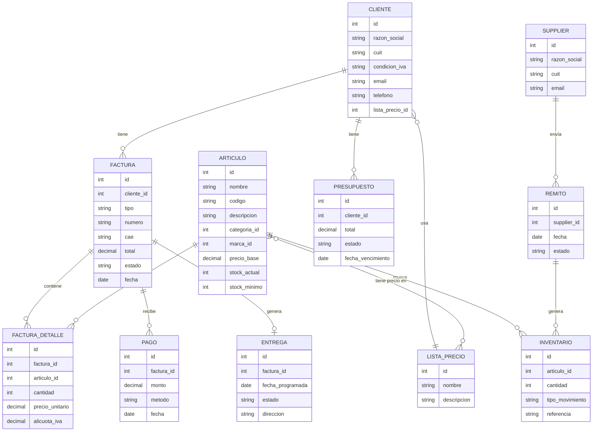

---

## Multitenant

Cada empresa utiliza el sistema con datos completamente aislados.

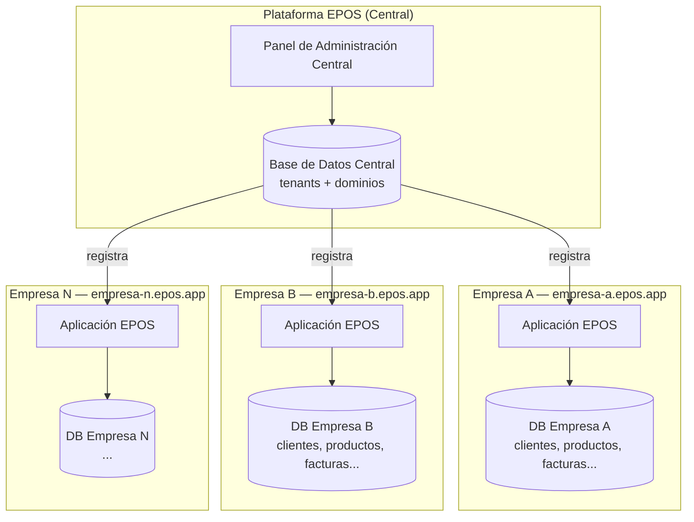

**Características del modelo multitenant:**

| Característica | Detalle |
|---|---|
| Aislamiento de datos | Cada empresa tiene su propia base de datos MySQL |
| Ruteo por dominio | `empresa.epos.app` determina el tenant activo |
| Configuración independiente | Cada empresa configura sus propios certificados AFIP, logo, etc. |
| Escalabilidad | Se pueden agregar N empresas sin afectar a las otras |
| Administración central | Panel separado para gestión de tenants y facturación SaaS |

---

## Stack Tecnológico

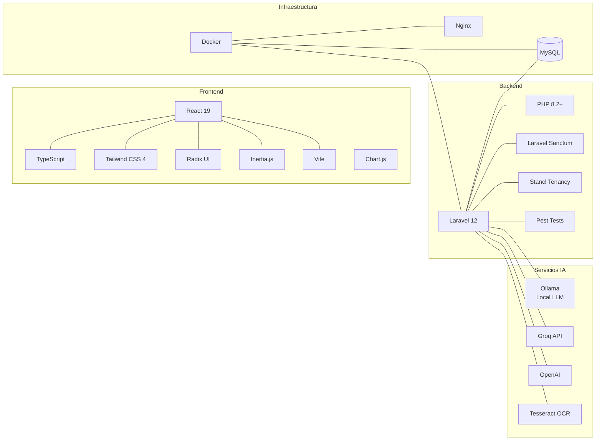

### Resumen de Tecnologías

| Categoría | Tecnología | Versión |
|---|---|---|
| Framework Backend | Laravel | 12 |
| Lenguaje Backend | PHP | 8.2+ |
| Framework Frontend | React | 19 |
| Tipado Frontend | TypeScript | 5.x |
| Bridge SSR | Inertia.js | 2.x |
| CSS | Tailwind CSS | 4.x |
| Componentes UI | Radix UI | latest |
| Base de Datos | MySQL | 8.x |
| Autenticación | Laravel Sanctum | — |
| Multitenant | Stancl/Tenancy | 3.9 |
| Testing PHP | Pest | 3.x |
| Build Tool | Vite | 6.x |
| Contenedores | Docker + Compose | — |

---

## Asistente de Compras (IA)

Módulo que utiliza OCR e Inteligencia Artificial para automatizar la carga de facturas de proveedores.

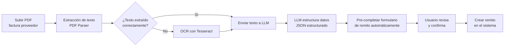

**Resultado:** Reducción drástica del tiempo de carga de facturas de proveedores, eliminando la digitación manual de líneas de artículos, cantidades y precios.

---

*Documentación generada para EPOS v1.0 — Sistema de Gestión Comercial para el mercado argentino.*
